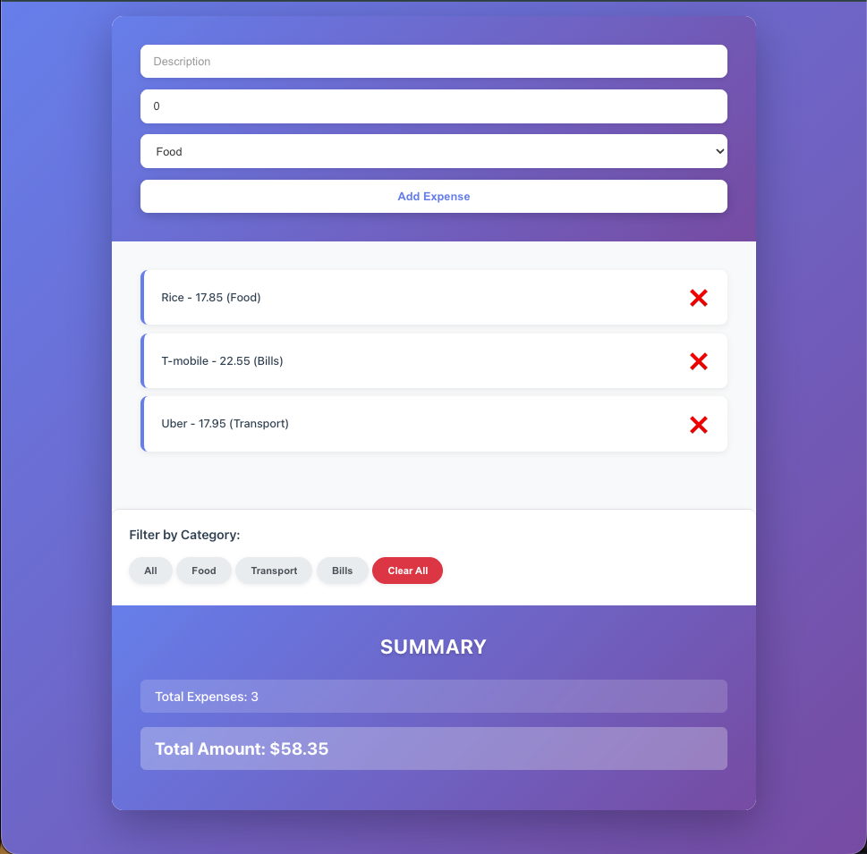
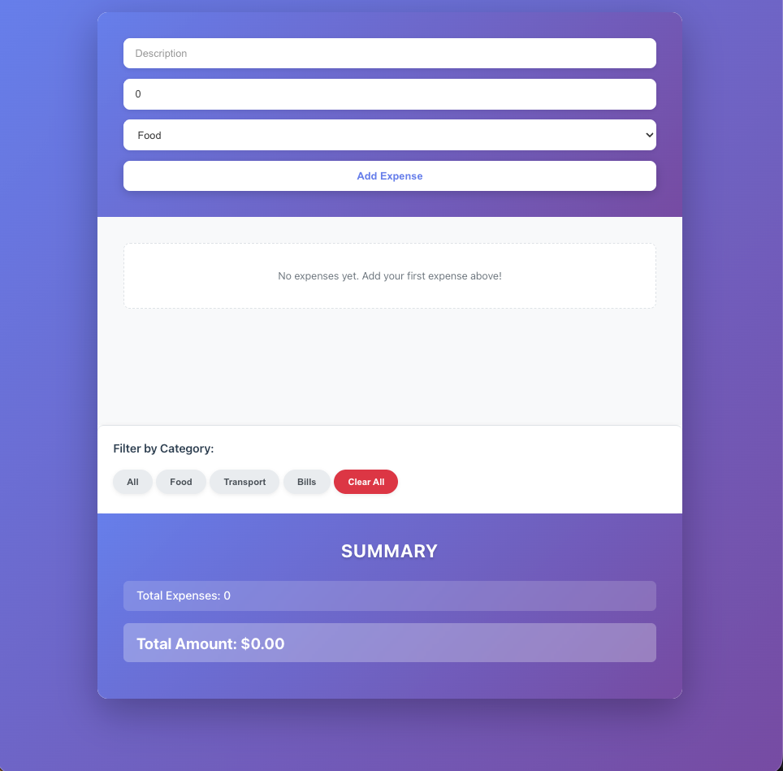

# Expense Tracker

A sleek and intuitive **React.js Expense Tracker** app to help you manage daily expenses efficiently.
Easily add, view, filter, and delete expenses — with a clean summary of your total spending.

---

## Features

* Add new expenses with description, amount, and category
* Filter expenses by category (Food, Transport, Bills, etc.)
* Delete individual expenses or clear all at once
* Live summary showing total count and total amount
* Responsive modern UI with gradient backgrounds and rounded components

---

## Screenshots

### Expenses Added



### No Expenses State



### Demo


---

## Tech Stack

* **React.js** (Functional Components + Hooks)
* **CSS3** (Custom gradients & card layout)
* **Create React App** (for development)
* **JavaScript (ES6)**

---

## Project Structure

```
src/
 ├── components/
 │   ├── AddExpenseForm/
 │   ├── ExpenseList/
 │   ├── ExpenseFilter/
 │   └── Summary/
 ├── App.js
 ├── App.css
 └── index.js
```

---

## Installation & Setup

1. **Clone the repository**

   ```bash
   git clone https://github.com/Soumya98-dev/expense-tracker.git
   cd expense-tracker
   ```

2. **Install dependencies**

   ```bash
   npm install
   ```

3. **Run the app**

   ```bash
   npm start
   ```

4. Open your browser at
   `http://localhost:3000`

---

## Example Categories

* Food
* Transport
* Bills
* Miscellaneous

---

## Future Improvements

* Add local storage persistence
* Add date-based filtering
* Integrate charts for expense visualization
* Implement authentication for multi-user tracking

---

## Author

**Soumyadeep Chatterjee** | 
Wayne State University | Detroit, MI | 
[LinkedIn](https://www.linkedin.com/in/soumyadeep-chatterjee-dev/) • [GitHub](https://github.com/Soumya98-dev)
